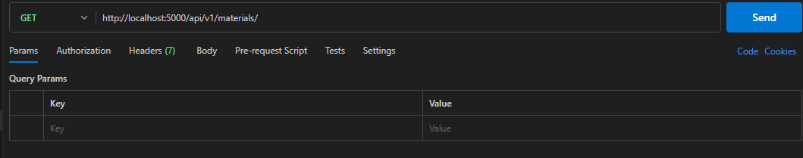
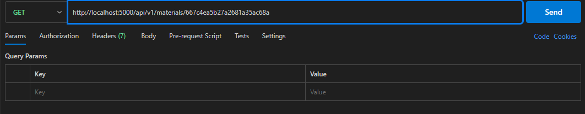
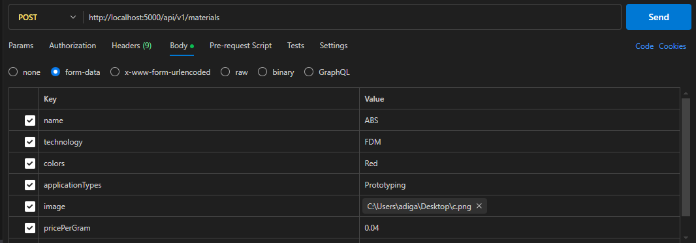

# 3D Printing Materials

## Introduction
This project is a server application built using Node.js and Express. It includes a mongoose connection for storing and retrieving data. This README provides detailed instructions for setting up , running the server, requesting and Responses.

## Prerequisites
Node v20.10.0

## Installation
1) Clone the repository: -
```
git clone https://github.com/yourusername/yourproject.git
cd yourproject
```
2) Install dependencies:
```
npm install
```
3) Change a `.env.example` file to `.env` in the root directory and add required data
```
# MongoDB Databse connection
DATABASE_URL=mongodb+srv://<username>:<paassword>@cluster-name/database-name

# AWS ACCESS KEY, SECRET KEY, REGION, S3 BUCKET
AWS_ACCESS_KEY=
AWS_SECRET_KEY=
AWS_REGION=
AWS_S3_BUCKET_NAME=
```
4) Run the server in the terminal
```
npm start
```

## Api Documentation
Base URL : `http://localhost:5000/api/v1/`


### Endpoints
1) Get All Materials
URL : `http://localhost:5000/api/v1/materials`
Method: `GET`
Description: Get all materials from the database.
Request: 
```
{
    "status": "success",
    "message": [
        {
            "_id": "667c4ea5b27a2681a35ac68a",
            "name": "CDS",
            "technology": "FDM",
            "colors": [
                "Black ",
                "White",
                "Red"
            ],
            "pricePerGram": 0.05,
            "applicationTypes": [
                "Prototyping",
                "Mechanical parts"
            ],
            "imageUrl": "https://lms-rnsoft.s3.ap-south-1.amazonaws.com/images/69fc8f30-6d2a-46c3-8944-913ba7bfd298",
            "__v": 0
        },
        {
            "_id": "667c4f3d56c039ca176f25ff",
            "name": "CDS",
            "technology": "FDM",
            "colors": [
                "Black ",
                "White",
                "Red"
            ],
            "pricePerGram": 0.04,
            "applicationTypes": [
                "Prototyping",
                "Mechanical part"
            ],
            "imageUrl": "https://lms-rnsoft.s3.ap-south-1.amazonaws.com/images/404cb076-76fa-49b8-b905-6c0e5df6202d",
            "__v": 0
        },
        {
            "_id": "667c4f831c79b0c7c639326f",
            "name": "CDS",
            "technology": "FDM",
            "colors": [
                "Black ",
                "White",
                "Red"
            ],
            "pricePerGram": 0.04,
            "applicationTypes": [
                "Prototyping",
                "Mechanical part"
            ],
            "imageUrl": "https://lms-rnsoft.s3.ap-south-1.amazonaws.com/images/f48eafb7-6de8-4a7f-965d-7a9074c84f7c",
            "__v": 0
        }
    ]
}
```
2. Get a Single Material
URL: `http://localhost:5000/api/v1/materials/f48eafb7-6de8-4a7f-965d-7a9074c84f7c`

Method: `GET`

Description: Retrieves a single material by ID.

Request: 
Response:
```
{
    "status": "success",
    "message": {
        "_id": "667c4ea5b27a2681a35ac68a",
        "name": "CDS",
        "technology": "FDM",
        "colors": [
            "Black ",
            "White",
            "Red"
        ],
        "pricePerGram": 0.05,
        "applicationTypes": [
            "Prototyping",
            "Mechanical parts"
        ],
        "imageUrl": "https://lms-rnsoft.s3.ap-south-1.amazonaws.com/images/69fc8f30-6d2a-46c3-8944-913ba7bfd298",
        "__v": 0
    }
}
```

3) Create an Material
URL: `http://localhost:5000/api/v1/materials`

Method: `POST`

Description: Adds a new material to the database.

Request Body: 

Response:
```
{
    "status": "success",
    "message": {
        "name": "ABS",
        "technology": "FDM",
        "colors": [
            "Red"
        ],
        "pricePerGram": 0.04,
        "applicationTypes": [
            "Prototyping"
        ],
        "imageUrl": "https://lms-rnsoft.s3.ap-south-1.amazonaws.com/images/91c7e271-94e4-489a-91ca-aa64f602459f",
        "_id": "667c5cb7c8fdd2b23d879d35",
        "__v": 0
    }
}
```